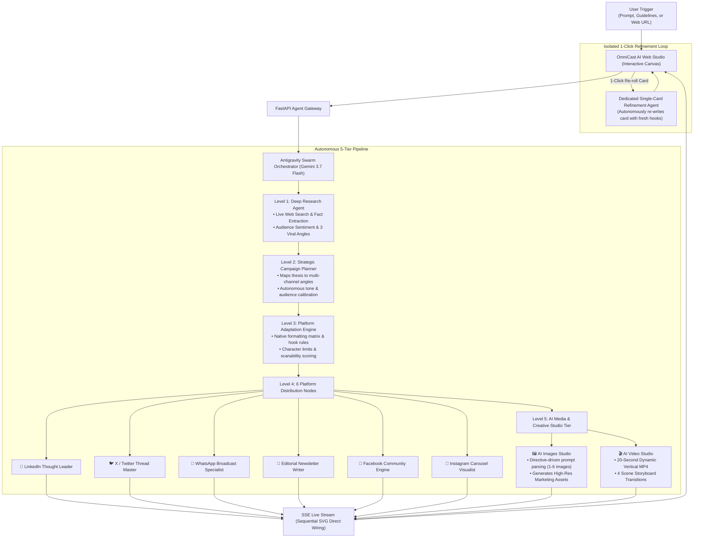

# ⚡ OmniCast AI — Autonomous Multi-Platform Content Studio Swarm

> **Live Production URL:** [https://omnicast-ai-296127548041.us-central1.run.app](https://omnicast-ai-296127548041.us-central1.run.app)  
> Built with **Google Antigravity & Gemini 3.7 Flash**, deployed on **Google Cloud Run**.

---

## 🌟 Executive Summary

Creating high-performing digital campaigns today requires hours of fragmented effort across multiple platforms and tools. Creators and marketing teams must research trending topics, formulate platform-specific strategies, calibrate tone, write custom video storyboards, format LinkedIn posts, craft Twitter threads, draft WhatsApp announcements, format newsletters, design visual carousels, generate image assets, and render promotional videos.

**OmniCast AI** automates this entire production pipeline. With a **single prompt, target guideline, or URL**, an autonomous multi-agent swarm performs live internet research, constructs a unified campaign narrative, calibrates platform-fitting rules, generates tailored content for 6 major platforms, and renders directive-driven **AI Images** and **20-second dynamic MP4 video assets** on an interactive visual workflow canvas.

---

## 🌐 Live Web Demo

You can access the live production instance here:  
👉 **[https://omnicast-ai-296127548041.us-central1.run.app](https://omnicast-ai-296127548041.us-central1.run.app)**

---

## 🏛️ System Architecture (11-Node Swarm)



---

## 🎯 Key Capabilities

### 1. 🔍 Autonomous Deep Research & Live Web Intelligence
* Ingests topics or crawls web URLs directly.
* Queries live internet search engines to extract verifiable facts, statistics, audience sentiment, and 3 distinct viral angles.
* Generates a dedicated **Deep Research Dossier** on the visual canvas.

### 2. 🧠 Strategic Campaign Architecture
* Formulates the overarching thesis, target audience demographics, and platform-specific narrative angles.

### 3. 📐 Platform Adaptation & Fitting Engine
* Calibrates the core thesis into native platform mechanics, character limits, hook architecture (e.g. 3 lines before LinkedIn *"…see more"*), mobile scanability, and engagement loops.

### 4. ✍️ Native Channel Distribution (6 Platforms)
* 💼 **LinkedIn:** Executive takeaways, clean spacing, bulleted structure, 3-5 targeted hashtags.
* 🐦 **X (Twitter):** 280-char strict constraints, curiosity hook, 5-tweet thread.
* 💬 **WhatsApp:** Native WhatsApp Markdown (`*bold*`, `_italics_`, bullet points, emojis).
* 📧 **Email Newsletter:** 3 Subject line variations, preview snippet, structured body with H2 headings, and sign-off.
* 👥 **Facebook:** Community-centric conversational narrative.
* 📸 **Instagram:** Hook opening line, 5-slide carousel outline, 15 hashtags.

### 5. 🎨 AI Media Studio (Images & Video Tier)
* 🖼️ **AI Images Studio:** Directive-driven prompt parser detects exact user image requests (e.g. "Create 4 promotional posters") and generates 1-6 high-resolution assets with 1-click downloads.
* 🎬 **AI Video Studio:** Renders 20-second vertical MP4 videos with 4 dynamic scene transitions, storyboard subtitles, and instant MP4 downloads.

### 6. 🎛️ Interactive Canvas & Node Controls
* 📋 **1-Click Copy:** Instant clipboard copy with visual confirmation.
* 💾 **Direct Download:** Download individual posts as `.txt` or `.md`.
* ✏️ **Inline Editing:** Edit text directly in the modal dialog and save.
* 🔄 **1-Click Autonomous Re-Roll:** Spins up an isolated sub-agent to explore alternative high-retention angles.
* 📜 **Campaign History Drawer:** Auto-saves past campaigns to local storage with restore and delete options.
* 🆕 **Fresh Start ("Create New"):** 1-click clean canvas reset.
* 📦 **1-Click Production Bundle (ZIP):** Packages all generated content, scripts, images, and video into a single archive.

---

## 🚀 Quickstart Guide

### 1. Prerequisites
* Python 3.10+
* (Optional) `GEMINI_API_KEY`

### 2. Local Setup
```bash
# Clone repository
git clone https://github.com/ibrahimdot20/OmniCast-AI.git
cd OmniCast-AI

# Install dependencies
pip install -r requirements.txt

# (Optional) Set your API key
export GEMINI_API_KEY="your_api_key_here"

# Start the application
python -m uvicorn backend.app.main:app --host 127.0.0.1 --port 8080
```

Open your browser at: **`http://localhost:8080`**

---

## ☁️ Production Deployment on Google Cloud Run

OmniCast AI is fully containerized and optimized for Google Cloud Run:

```bash
# Deploy directly from source to Cloud Run
gcloud run deploy omnicast-ai \
  --source . \
  --platform managed \
  --region us-central1 \
  --allow-unauthenticated \
  --set-env-vars GEMINI_MODEL="gemini-3.7-flash" \
  --memory 1Gi \
  --cpu 1 \
  --timeout 300
```

---

## 🛡️ Security & Environment Configuration

* **Zero Secret Exposure:** Real API keys are never tracked or committed to Git (`.gitignore` excludes all `.env` and secret files).
* **Safe Configuration Template:** Use `.env.example` to configure local variables.
* **Non-Root Container:** Production Dockerfile built on lightweight `python:3.12-slim`.

---

## 📄 License
MIT License. Open source and ready for production deployment.
