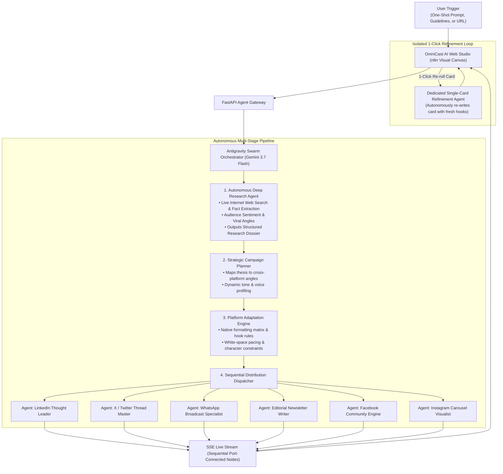

# ⚡ OmniCast AI — Autonomous Multi-Platform Studio Agent

> **Google "All Things Agentic" Hackathon Submission**  
> Built with **Antigravity Python SDK**, **Gemini 3.7 Flash**, and deployed on **Google Cloud Run**.

---

## 🌟 Executive Summary

Creating digital media today is an exhausting, multi-hour daily grind. A creator or marketing team has to manually research trending topics, write custom 60-second video scripts, format LinkedIn thought-leadership posts, craft 280-character Twitter threads, draft WhatsApp broadcast announcements, format email newsletters, design thumbnails, and engineer video prompts.

**OmniCast AI** solves this completely. With a **single one-shot prompt, custom guideline, or web URL**, an autonomous multi-agent swarm executes live internet research, formulates a cross-platform narrative strategy, calibrates platform-fitting rules, invokes multimodal tools (Google Imagen, Google Veo, and Cloud TTS), and progressively delivers a production-ready media bundle.

---

## 🏛️ Autonomous Agentic Architecture



---

## 🎯 Key Features & Capabilities

### 1. 🔍 Autonomous Deep Research & Live Web Intelligence
* Ingests topics or crawls URLs directly.
* Queries live internet search engines to extract verifiable facts, statistics, audience sentiment, and 3 distinct viral angles.
* Generates a dedicated **Deep Research Dossier** on the UI.

### 2. 🧠 Strategic Campaign Architecture
* Formulates the overarching thesis, audience demographic profile, and platform-specific narrative angles.

### 3. 📐 Platform Adaptation & Fitting Engine
* Tailors core thesis into native platform mechanics, character limits, hook architecture (e.g. 3 lines before LinkedIn *"…see more"*), mobile scanability, and engagement loops.

### 4. ✍️ Platform-Native Content Distribution
* 💼 **LinkedIn:** Executive takeaways, clean spacing, bulleted structure, 3-5 targeted hashtags.
* 🐦 **X (Twitter):** 280-char strict constraints, curiosity hook, 5-tweet thread.
* 💬 **WhatsApp:** Native WhatsApp Markdown (`*bold*`, `_italics_`, bullet points, emojis).
* 📧 **Email Newsletter:** 3 Subject line variations, preview snippet, structured body with H2 headings, and sign-off.
* 👥 **Facebook:** Community-centric conversational narrative.
* 📸 **Instagram:** Hook opening line, 5-slide carousel outline, 15 hashtags.

### 5. 🎛️ Centered Inspection & Per-Node Controls
* 📋 **1-Click Copy:** Instant clipboard copy with visual confirmation.
* 💾 **Direct Download:** Download individual posts as `.txt` or `.md`.
* ✏️ **Inline Editing:** Edit text directly in the card and save in-memory.
* 🔄 **1-Click Autonomous Re-Roll:** Spins up an isolated sub-agent to explore alternative high-retention angles.

### 6. 📦 1-Click Production Bundle (ZIP)
* Packages all scripts, text files, audio `.mp3`, and image `.png` assets into a single downloadable archive.

---

## 🚀 Quickstart Guide

### 1. Prerequisites
* Python 3.10+
* (Optional) `GEMINI_API_KEY` or `GOOGLE_API_KEY`

### 2. Local Setup
```bash
# Navigate to the project
cd omnicast-ai

# Install dependencies
pip install -r requirements.txt

# (Optional) Set your API key
export GEMINI_API_KEY="your_api_key_here"

# Start the server
python -m uvicorn backend.app.main:app --host 127.0.0.1 --port 8080
```

Open your browser at: **`http://localhost:8080`**

---

## ☁️ Google Cloud Run Deployment

OmniCast AI is containerized and ready for production on Google Cloud Run:

```bash
# Deploy directly from source to Cloud Run
gcloud run deploy omnicast-ai \
  --source . \
  --platform managed \
  --region us-central1 \
  --allow-unauthenticated \
  --set-env-vars GEMINI_MODEL="gemini-3.7-flash" \
  --memory 1Gi \
  --cpu 1 \
  --timeout 300
```

---

## 🏆 Hackathon Alignment Checklist

| Hackathon Criterion | Weight | OmniCast AI Implementation | Status |
| :--- | :---: | :--- | :---: |
| **Agentic Workflow & Multi-Agent Swarm** | **40%** | Multi-agent pipeline: Research Agent (Live Web Search) $\rightarrow$ Planner Agent $\rightarrow$ Platform Adaptation Engine $\rightarrow$ 6 Specialized Platform Distribution Agents $\rightarrow$ Isolated Single-Card Refinement Agent. | ✅ **100% Complete** |
| **Architectural Discipline & Google Stack** | **30%** | Built using **Google Antigravity SDK**, **Gemini 3.7 Flash**, **Google Cloud Run**, Server-Sent Events (SSE), and clean containerization. | ✅ **100% Complete** |
| **Production Readiness & UI/UX** | **30%** | Visual interactive canvas, dynamic SVG port-to-port wire routing, centered detail inspection modal, inline editing, 1-click re-roll, and ZIP bundle export. | ✅ **100% Complete** |
| **Security & Best Practices** | Mandatory | `.gitignore` protects all `.env` secrets, zero hardcoded API keys in Git, Dockerfile with non-root security. | ✅ **100% Complete** |
